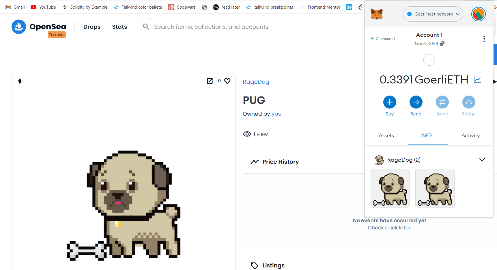
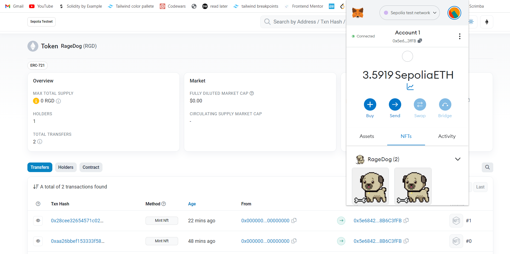
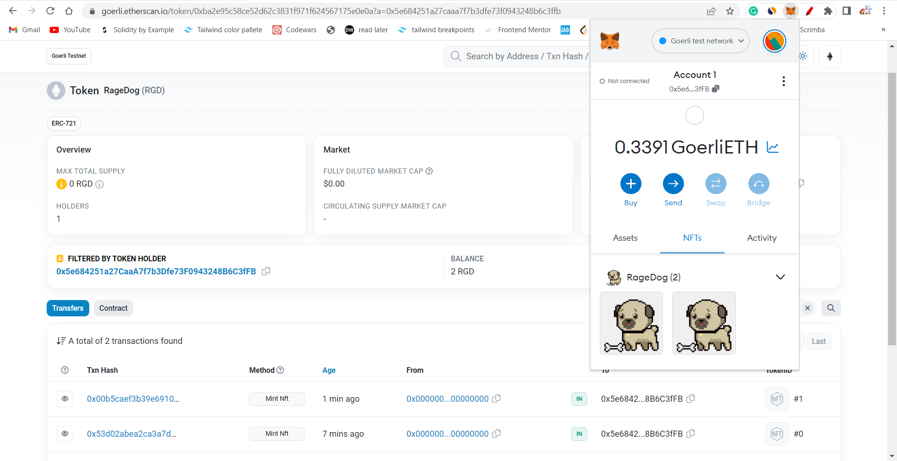

# RageDogs (RGD) - Basic NFT Collection

RageDogs is a basic NFT (non-fungible token) collection that uses the ERC-721 token standard. This project deploys the NFT contract on multiple testnets.

## Table of Contents
- [Background](#background)
- [Deployment](#deployment)
- [Usage](#usage)
- [Contributing](#contributing)
- [License](#license)

## Background
This project creates a collection of basic NFTs called RageDogs, which are unique digital assets that can be bought, sold, and traded on a blockchain. These NFTs are created using the ERC-721 token standard, which ensures that they are unique and non-fungible.

The collection is currently deployed on two testnets: Sepolia and Goerli. The contract addresses for each deployment can be found below.

## Deployment
To deploy the RageDogs NFT collection on a testnet, follow these steps:

1. Clone this repository to your local machine.
2. Run `npm install` to install the necessary dependencies.
3. Run `npx hardhat compile` to compile the smart contracts.
4. Configure your deployment environment by adding your private key and infura API key to the `.env` file. An example `.env.example` file is provided in the project root.
5. Run `npx hardhat deploy --network <network>` to deploy the NFT contract to your desired network. Replace `<network>` with the name of the network you wish to deploy to.

The NFT collection is currently deployed on the following testnets:

 
- Sepolia: `0x8F09186C19849aE49E03f9bEED89314C26996eFF`

- Goerli: `0xba2e95c58Ce52d62c3831f971F624567175E0e0a`

## Usage
Once the NFT collection is deployed, you can interact with it using any Ethereum wallet that supports ERC-721 tokens, such as MetaMask.

To mint a new RageDog NFT, call the `mint` function on the deployed contract. This function takes a single argument, which is a string representing the IPFS hash of the NFT metadata. This metadata should be in JSON format and should include a name and image for the NFT.

To transfer a RageDog NFT, call the `safeTransferFrom` function on the deployed contract. This function takes three arguments: the address of the current owner of the NFT, the address of the new owner of the NFT, and the token ID of the NFT.

For more information on using ERC-721 tokens, see the [EIP-721 specification](https://eips.ethereum.org/EIPS/eip-721).

## Contributing
If you'd like to contribute to this project, please create a fork of the repository and submit a pull request with your changes. Before submitting your pull request, please make sure that your changes pass the project's tests and conform to the project's style guidelines.

## License
This project is licensed under the MIT License.
